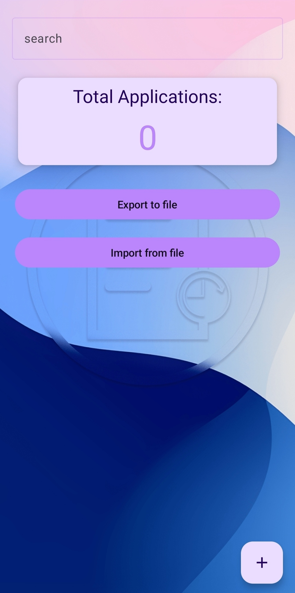

# Apply History

Welcome to **ApplyHistory**! This project is a secure date recording app for people who are planning to apply.

## Technologies used

- **Jetpack Compose**: Modern toolkit for building native Android UI.
- **Room**: Persistence library providing an abstraction layer over SQLite to allow fluent database access.
- **Koin**: An easy and efficient way to incorporate dependency injection into any Kotlin application.
- **MVI Structure**: Model-View-Intent architectural pattern to manage state and business logic.
- **Navigation Compose**: Type-Safe navigation introduced in the 2024 google events.
- **JUnit**: Behavior of a small section of code, the unit under test. It does so by executing that code and checking the result.
- **MockK**: Mocking library which is frequently used by Android developers and written in the Kotlin language.
- **Robolectric**: By using the robot pattern, you can combine and chain them into various tests with different goals.
## published

You can find the latest versions of ApplyHistory [here](https://github.com/yourusername/ApplyHistory/releases).

## screen shot

Here are some images of ApplyHistory in action:

## Thank you

Thanks to [@NasrinMohammadzadeh](https://github.com/NasrinMohammadzadeh) for the support and initial idea of ​​the app.
